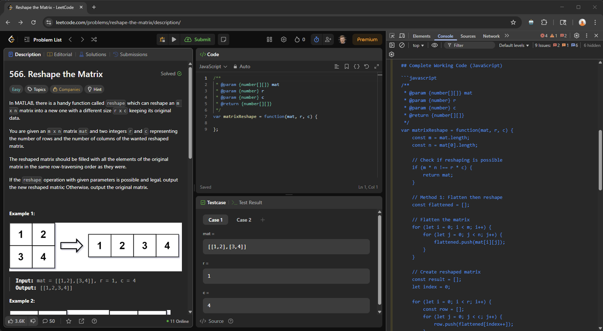
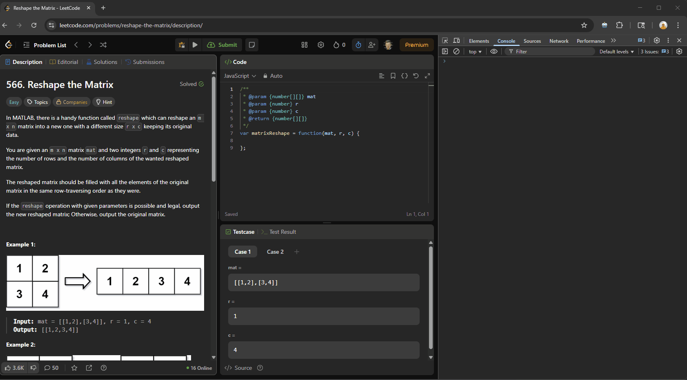

# AI Tech Task Solver - Chrome Extension



A Chrome extension that uses AI to analyze web page screenshots, solve technical problems and coding challenges, and display solutions directly in the browser console.

## Features

- **One-click Analysis**: Click "Analyze the page" to capture and analyze any webpage
- **AI-Powered**: Uses OpenAI GPT-4 Vision or Anthropic Claude for intelligent analysis
- **Configurable**: Support for multiple AI providers and programming languages
- **Console Output**: Results are displayed in the browser's developer console
- **Screenshot Capture**: Uses html2canvas for high-quality page screenshots

## Demo

Speeded up for demo purposes:



## Installation

1. Clone or download this repository
2. Open Chrome and navigate to `chrome://extensions/`
3. Enable "Developer mode" in the top right
4. Click "Load unpacked" and select the extension directory
5. The extension icon should appear in your Chrome toolbar

## Configuration

1. Right-click the extension icon and choose `Options`
2. Choose your AI provider:
   - **Anthropic Claude**: Click "Anthropic Claude" preset
   - **OpenAI GPT-4**: Click "OpenAI GPT-4" preset
3. Enter your API key
4. Optionally customize:
   - AI Model (e.g., `claude-sonnet-4-20250514`, `gpt-4.1-2025-04-14`)
   - Output Programming Language
   - Max Tokens (100-4000)
5. Click "Save Settings"

## Usage

1. Navigate to any webpage with a technical problem or coding challenge
2. Click the extension icon in the Chrome toolbar
3. Wait for the analysis to complete
4. Open Developer Console (F12) to see the AI analysis results

## Supported AI Providers

### Anthropic Claude
- API URL: `https://api.anthropic.com/v1/messages`
- Models: `claude-sonnet-4-20250514`, etc.
- Get API key: [Anthropic Console](https://console.anthropic.com/)

### OpenAI GPT-4 Vision
- API URL: `https://api.openai.com/v1/chat/completions`
- Models: `gpt-4.1-2025-04-14`, etc.
- Get API key: [OpenAI Platform](https://platform.openai.com/)

## What It Analyzes

The extension can analyze various types of content:

- **Coding Problems**: LeetCode, HackerRank, programming challenges
- **System Design**: Architecture diagrams, technical specifications
- **Documentation**: API docs, technical guides
- **Error Messages**: Stack traces, compiler errors
- **General Technical Content**: Any technical problem or question

## Output Format

For coding problems, the AI provides:
1. Problem explanation
2. Solution approach
3. Complete working code in your preferred language
4. Time/space complexity analysis

For other technical content:
- High-level solution or summary
- Design recommendations
- Technical explanations

## Files Structure

```
ai-tech-task-solver-chrome-extension/
├── manifest.json          # Extension configuration
├── popup.html             # Extension popup UI
├── popup.js               # Popup functionality
├── content.js             # Page screenshot capture
├── background.js          # AI API communication
├── options.html           # Configuration page
├── options.js             # Options functionality
├── html2canvas.min.js     # Screenshot library
├── icons/                 # Extension icons
│   ├── icon16.png
│   ├── icon48.png
│   └── icon128.png
└── README.md              # This file
```

## Permissions

The extension requires these permissions:
- `activeTab`: To capture screenshots of the current page
- `storage`: To save configuration settings
- `scripting`: To inject content scripts
- Host permissions for AI API endpoints

## Privacy & Security

- API keys are stored securely in Chrome's sync storage
- Screenshots are processed locally and sent only to your configured AI provider
- No data is stored or transmitted to third parties
- All communication uses HTTPS

## Troubleshooting

### Extension not working
- Check that you've configured an API key in options
- Verify your API key is valid and has sufficient credits
- Check the browser console for error messages

### Screenshot issues
- Ensure the page has finished loading
- Some pages with complex layouts may not capture perfectly
- Try refreshing the page and analyzing again

### API errors
- Verify your API key is correct
- Check that you have sufficient API credits/quota
- Ensure the AI model name is correct for your provider

## Development

To modify or extend the extension:

1. Make changes to the source files
2. Go to `chrome://extensions/`
3. Click the refresh icon on the extension card
4. Test your changes

## License

This project is open source. Feel free to modify and distribute according to your needs.

## Support

For issues or questions:
1. Check the browser console for error messages
2. Verify your configuration in the options page
3. Test with a simple webpage first
4. Ensure your AI provider API is working correctly

## Buy Me A Coffee

<a href="https://buymeacoffee.com/ivan.seredkin" target="_blank"></a>
